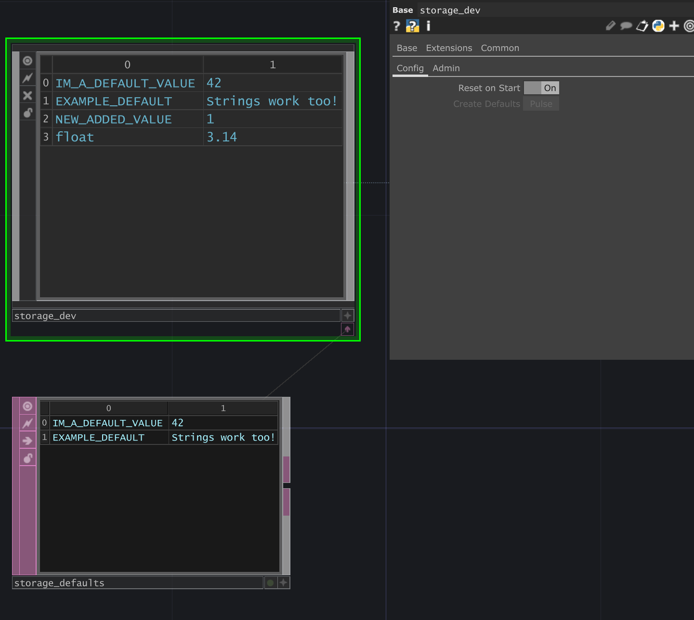

# Touch State Storage
A tox asset used to create store global values in a single location with easy access. This tool is basically just a wrapper of a Table DAT with nice python functions to get or set values. Additionally it allows for default state values which can be reset at any time.

## Install
To install drag in the tox file from the release folder or download it from the [releases page](https://github.com/JohnENoonan/touch-state-storage/releases).

### Requirements
The storage tox requires the [touch-logger logging tool](https://github.com/JohnENoonan/touch-logger) to log out warnings on invalid keys. Simply install the logger and drag the tox into your project.

## Usage
* Instantiate the storage Base COMP
* If you'd like the storage tool to reset on startup enable the toggle `Config/Reset on Start`
* To create default stored values pulse `Config/Create Defaults`
	* This will create a docked Table DAT which you can write your default values into. This DAT can be externalized and saved as a file for easy version control.

To interact with the storage tool you can:
1. Use the Python API with the global shortcut `op.storage`. An example usage could be `op.storage.Set("Keyname", "value")`
2. Select the underlying table in a Select DAT with the path `op.storage.op("state")` 

3. Select the converted CHOP representation with a Select CHOP using the path `op.storage.op("state_chop")`. Please note that non-numerical values will be invalidly represented..

### Python API
| Function | Args | Notes |
|----------|------|-------|
| Get(key) | `key`: string | Get the value of the stored parameter at `key` name. The returned value is a string and None if the key is not present |
| Set(key, value) | `key`: string `value`: string, int, float, or bool | Set a value for a stored key. If the key does not exist it will be created |
| Remove(key) | `key`: string | Remove an entry. If the key does not exist no error is thrown. The functions returns `True` if successful or `False` if no entry was removed |
| Reset() | None | Resets all entries to their default value if the key is defined in the default table. All other keys will be left the same |
| ResetToDefaults() | None | Clears all stored elements and then stores only the default values |
| Clear() | None | Clear the stored entries. This is the same as calling `Remove()` on every existing key |